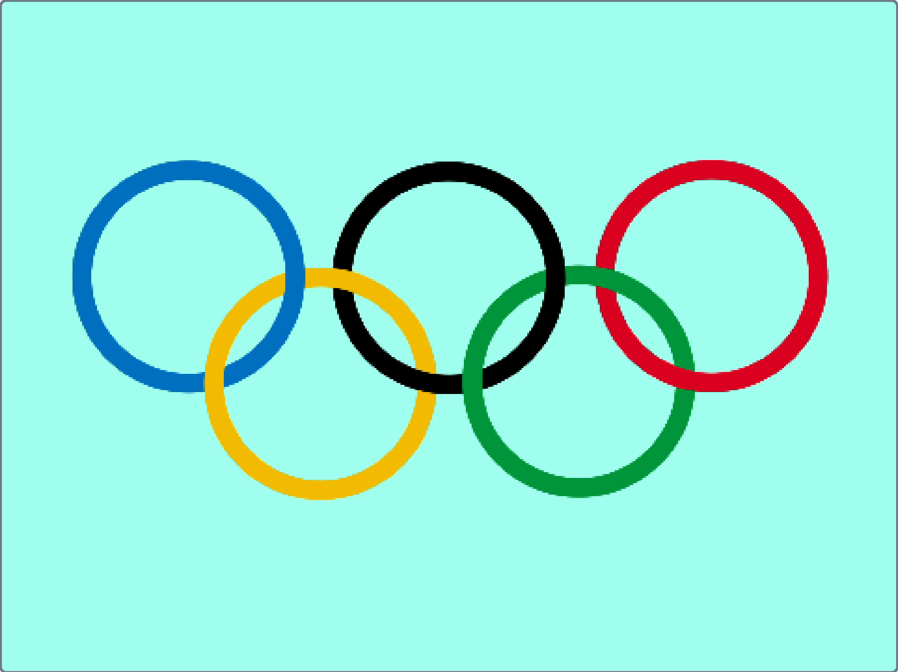

### What you will make

Use the pen extension blocks to draw the Olympic Rings, with correct detail about how they overlap.

--- no-print ---

  <iframe allowtransparency="true" width="485" height="402" src="https://scratch.mit.edu/projects/embed/1048245134/?autostart=false" frameborder="0"></iframe>

--- /no-print ---

--- print-only ---

--- /print-only ---

--- collapse ---
---
title: What you will need
---
### Software

+ Scratch 3 (either [online](http://rpf.io/scratchon){:target="_blank"} or [offline](http://rpf.io/scratchoff){:target="_blank"})

### Downloads

+ Download the project [starter file](https://scratch.mit.edu/projects/1048263697/){:target="_blank"} if working offline

--- /collapse ---

--- collapse ---
---
title: What you will learn
---

+ drawing tools
+ clones
+ variables

--- /collapse ---

--- collapse ---
---
title: Additional information for educators
---

You can download the completed project [here](https://scratch.mit.edu/projects/1048245134){:target="_blank"}.

If you need to print this project, please use the [printer-friendly version](https://projects.raspberrypi.org/en/projects/olympic-rings/print){:target="_blank"}.

--- /collapse ---
