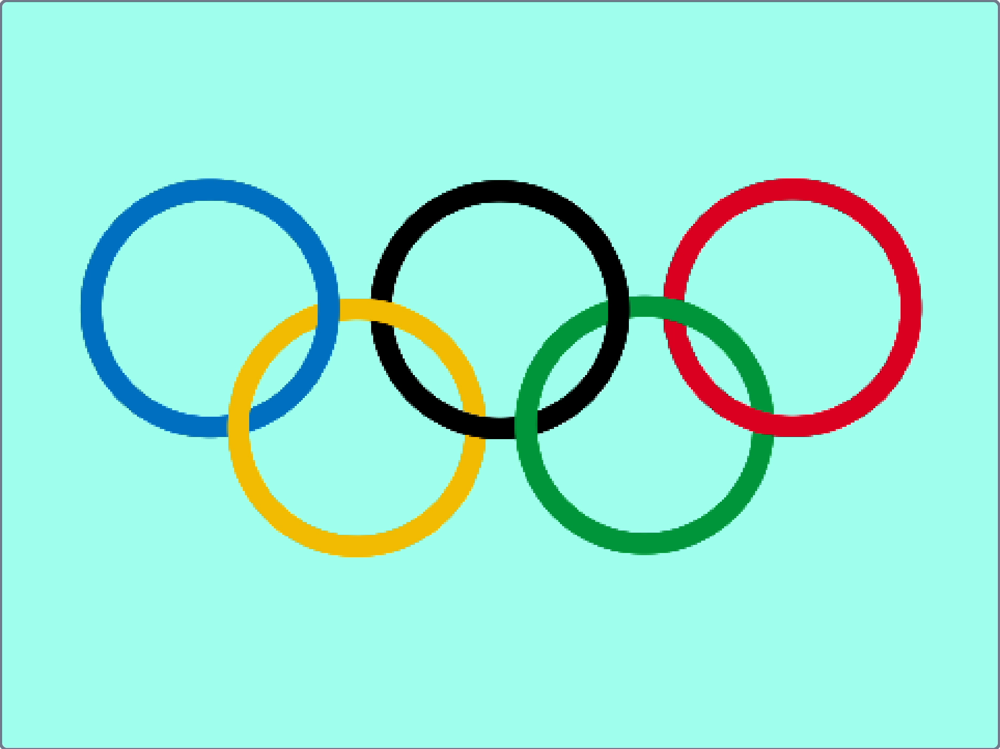

### Ce que tu vas faire

Tu vas utiliser les blocs d'extension Stylo pour dessiner les anneaux olympiques, en veillant à ce qu'ils se chevauchent correctement.

--- no-print ---

  <iframe allowtransparency="true" width="485" height="402" src="https://scratch.mit.edu/projects/embed/1048245134/?autostart=false" frameborder="0"></iframe>

--- /no-print ---

--- print-only ---

--- /print-only ---

--- collapse ---
---
title: Ce qu'il te faudra
---

### Logiciel

- Scratch 3 (soit [en ligne](http://rpf.io/scratchon){:target="_blank"} soit [hors ligne](http://rpf.io/scratchoff){:target="_blank"})

### Téléchargements

- Si tu travailles hors ligne, télécharge le [projet de démarrage](https://rpf.io/p/fr-FR/olympic-rings-go){:target="_blank"}

--- /collapse ---

--- collapse ---
---
title: Informations complémentaires pour les éducateur·rice·s
---

Tu peux télécharger le projet terminé [ici](https://scratch.mit.edu/projects/1048245134){:target="_blank"}.

Si tu dois imprimer ce projet, utilise la [version imprimable](https://projects.raspberrypi.org/fr-FR/projects/olympic-rings/print){:target="_blank"}.

--- /collapse ---

Merci à Kaye North de Code Club Australia pour le [projet original](https://www.codeclubau.org/projects/olympic-rings) !
